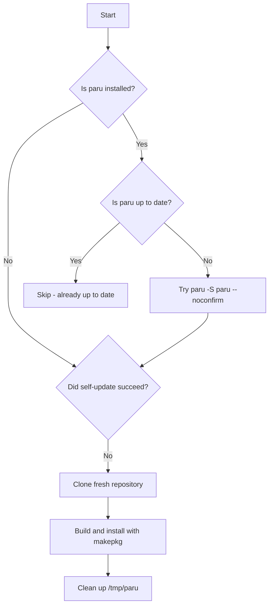

# paru

AUR helper for Arch Linux.

## Process

```mermaid
flowchart TD
    A[Start] --> B{Is paru installed?}
    B -->|No| C{Did self-update succeed?}
    B -->|Yes| D{Is paru up to date?}
    D -->|Yes| F[Skip - already up to date]
    D -->|No| E[Try paru -S paru --noconfirm]
    E --> C
    C -->|No| G[Clone fresh repository]
    G --> H[Build and install with makepkg]
    H --> I[Clean up /tmp/paru]
```